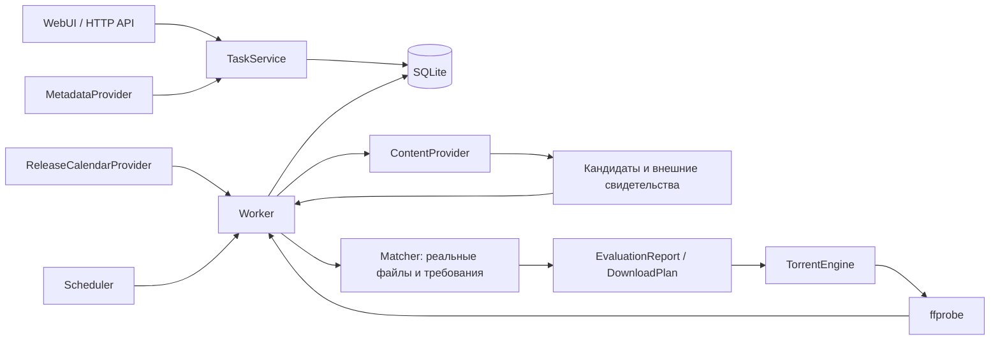
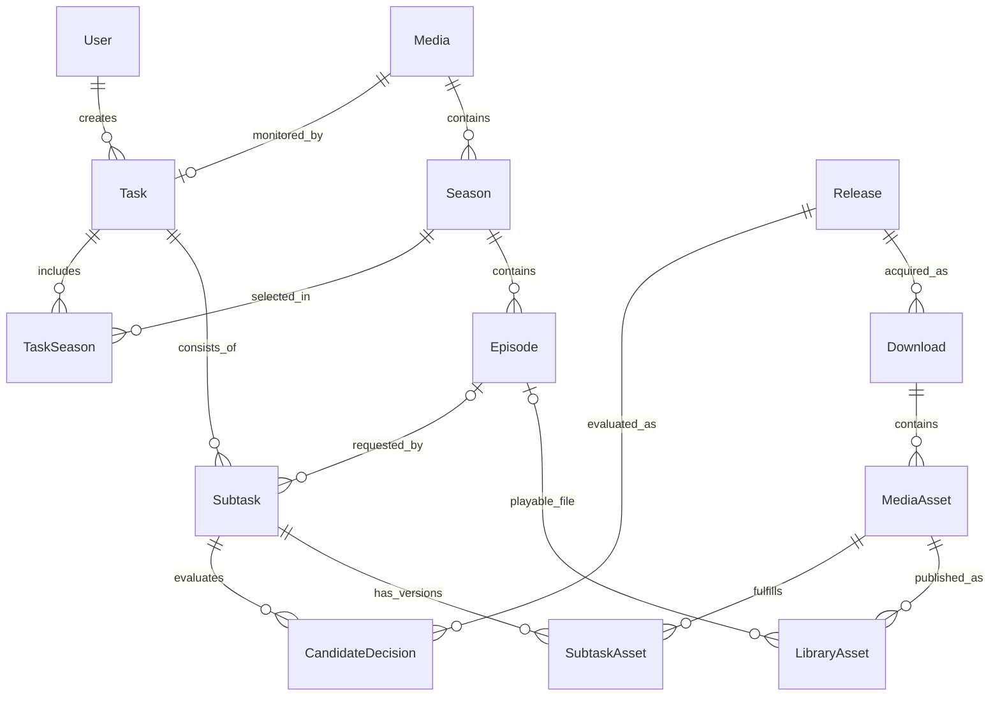

# Архитектура Lazarr

## Границы ответственности

`ContentProvider` не принимает окончательное решение. Он знает протокол ресурса, авторизацию, поиск, описание темы и способ получения торрента. Список файлов со страницы — `file_hints`.

`Worker.evaluate` вызывает `inspect` и `resolve_download`, получает torrent metadata через `TorrentEngine`, затем передаёт фактические файлы в `Matcher`. Результат содержит проверку каждой подтаски, а не одно решение для всего торрента. `Matcher` — чистый модуль Worker, без собственных запросов к трекерам.

`Worker.submit` сначала сохраняет намерение загрузки и связи в транзакции, затем вызывает движок. Если процесс завершается между этими операциями, `restore` завершает добавление из сохранённого torrent-файла. Один infohash имеет одну строку `Download`.

## Модель

- `Media` уникально по `(provider, external_id, kind)`: числовые ID фильма и сериала не смешиваются.
- `Season` уникален внутри произведения; `Episode` — внутри сезона.
- `Task` уникальна по `media_id`, хранит общие требования и автора. `TaskSeason` хранит выбранные сезоны, их нумерацию и признак отслеживания новых серий для каждого сезона. Миграция `0009` переносит существующие односезонные задачи; старые поля `Task` оставлены для совместимости. Сезон поискового запроса определяется через `Subtask → Episode → Season`. Миграция `0010` объединяет задачи медиа: требования последней изменённой задачи, объединение сезонов и серий, сохранение версий и переназначение связей загрузок. Старые параметры записываются в `AuditEvent` (`task.merge`). Версии с изменившимися требованиями требуют повторной проверки.
- `Subtask.part_key` исключает дубли эпизодов внутри задачи. Фильм использует `movie`.
- `Release` уникален по провайдеру, ID ресурса и фактической ревизии torrent metadata (infohash).
- `MediaAsset` уникален по загрузке и индексу видео. `SubtaskAsset` хранит собственные preflight/verification и ручное исключение; разные задачи могут выбрать разные внешние дорожки одного видео. После полной проверки Worker создаёт `LibraryAsset`, поэтому доступность файла не зависит от дальнейшего существования задачи.
- Флаги `pending` и `current` обозначают стадии одного выбранного файла серии. При замене `replacement.retire_selections` удаляет прежние связи `SubtaskAsset` и `LibraryAsset`, исключает серию из старого плана и сохраняет задания очистки ненужных файлов. Движок освобождает торрент перед удалением; планы и библиотечные связи других серий защищают общие видео и дорожки. Ошибки очистки повторяются до восстановления торрента. При запуске `prune_history` сворачивает старую историю существующих сабтасок до актуального выбора. Автоматического улучшения нет: готовые элементы не участвуют в поиске и не сбрасываются при редактировании требований. Признак `Task.completed` в API вычисляется по непустому набору завершённых элементов и не хранится отдельно.

## Исполнение

Планировщик и монитор загрузок — отдельные asyncio-задачи. Поиск выполняется один раз в день начиная с `Settings.search_start`, до завершения прохода. `scheduler.daily` сохраняет начало и завершение; отменённые группы освобождают lease и возобновляются. Часовой пояс определяется окружением `TZ` или `/etc/localtime`. Монитор работает каждые две секунды независимо от расписания. Блокирующие операции libtorrent и ffprobe выполняются в потоках.

Совместимые запросы группируются по произведению, сезону и требованиям. За один проход просматривается до пяти страниц каждого провайдера. Cooldown провайдера сохраняется в БД; ошибки не ломают другие провайдеры. Работа получает lease, продлеваемый при проверке кандидатов. Один процесс владеет каталогом данных через файловую блокировку.

Детерминированный порядок кандидатов: разрешение, недостающие субтитры, seeds, размер, ID. Наличие `UNKNOWN` среди обязательных критериев не даёт автоматического плана. Свойства одного видео не переносятся на остальные файлы сезонного пакета.

## Файлы и приоритеты

`DownloadPlan` хранит реальные пути, размеры, offsets и bindings. Движок повторно проверяет план против torrent metadata. Путь не может выйти за каталог загрузки; symlink-записи и конфликтующие имена отклоняются.

Следующая незавершённая серия получает приоритет видео 4, связанные внешние дорожки — 7, остальные выбранные серии — 1. Невыбранные файлы — 0. После `file_prio_alert` движок назначает piece-приоритеты и повышает начало/конец текущего видео до 7. Это исключает сброс piece-приоритетов асинхронным обновлением файлов.

`buffer_ready` проверяет конкретные полученные pieces, а не размер разреженного файла. Полная готовность относится к выбранным файлам, а не ко всему torrent pack. Общие граничные pieces могут содержать небольшие части невыбранных файлов.

## Права и секреты

Сессии хранят только SHA-256 токена и отдельный CSRF token. Пароли — Argon2id. Новые аккаунты получают роль `admin`; проверки capabilities проходят через один dependency слой API. Данные изменений записываются в `AuditEvent` без паролей и токенов.

Настройки провайдера разделены на открытые поля, шифрованные secrets и шифрованное состояние сессии. Изменение авторизации/домена инвалидирует cookies. Завершение старого запроса не восстанавливает сессию поверх новых настроек.

## Этапы и миграции

1. `0001_foundation`: аккаунты, настройки, провайдеры, Media/Season/Episode, Task/Subtask, аудит.
2. `0002_downloads`: Release, Download, MediaAsset, SubtaskAsset.
3. `0003_worker`: сохранённые CandidateDecision.
4. `0004`–`0007`: нумерация задач, время поиска, прогресс просмотра и метаданные эпизодов.
5. `0008_library_assets`: постоянные связи проверенных файлов с фильмами и эпизодами.

Библиотеки и Jellyfin-совместимый API читают проверенные версии через `LibraryAsset`, включая встроенные и внешние дорожки из раздачи; транскодинг не выполняется.

Миграция `0004` добавляет `Task.numbering`: схему отображения сезона и эпизодов, полученную из явных связей TMDB. Канонические внешние ID и связи `Subtask → Episode` сохраняются. Первый аккаунт создаётся через WebUI (`/setup`) либо CLI; транзакция `BEGIN IMMEDIATE` запрещает параллельное создание двух первоначальных администраторов.

Удаление задач синхронизируется с поиском и монитором. Проверенные `LibraryAsset` сохраняются при обычном удалении задачи, а связи других задач защищают общие Downloads и MediaAssets. Сначала движок подтверждает удаление торрента, затем транзакция удаляет связи задачи и сохраняет журнал `cleanup.*`; очистка каталогов повторяется до успеха. Повторная загрузка того же infohash ждёт окончания очистки.

### Немедленный и ручной поиск

`search.request.<task_id>` создаётся атомарно с Task/Subtask; `search.request.all` представляет ручной запуск. Scheduler будится через asyncio.Event, объединяет ожидающие запросы и выполняет один проход Worker. Уже запущенная группа заканчивается прежде следующей. Ключи обработанного снимка очереди удаляются только после успешного возврата; новые запросы, пришедшие во время поиска, остаются. Паузы, будущие даты и ожидающие проверки загрузки не обходятся ручным запуском.

`POST /api/v1/search/run` защищён сессией, разрешениями и CSRF, отвечает 202. `GET /api/v1/status.search` содержит состояние, провайдера, произведение/эпизоды, стадию, счётчики и последние 40 событий. В журнал не попадают URL с авторизацией, тела HTTP-запросов или секреты. Проверки торрент-структуры выполняются в потоках, поэтому HTTP API продолжает отдавать прогресс.

LibraryService объединяет постоянный read model Media → Episode → LibraryAsset → MediaAsset/Download/Release с активными Task/Subtask. Три встроенных библиотеки вычисляются по метаданным, без привязки к пользователю или физическому каталогу. `/api/v1/libraries` и `/api/v1/libraries/media/{id}` защищены разрешением library (admin/user). Метаданные SDK 1.4 содержат жанры, страны и исходный язык. `Subtask.last_search_at` (0005) фиксирует фактическую попытку поиска; отсутствие исторической даты передаётся как null.
